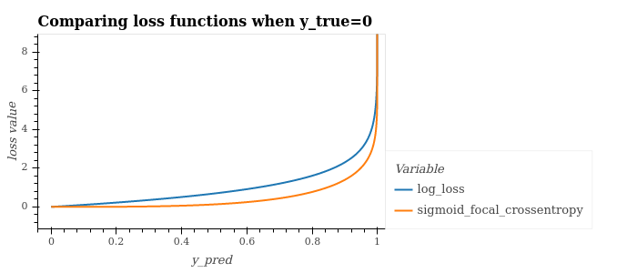
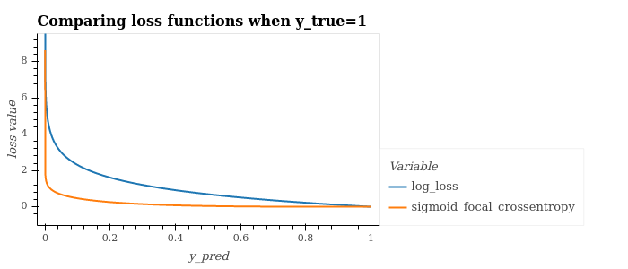
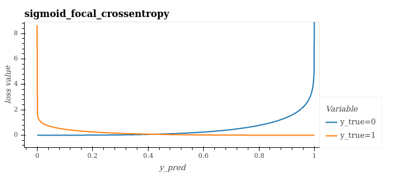

# Losses and Metrics

Loss functions are normally minimised (e.g. for learning/optimising a model), and metrics are normally maximised (e.g for further evaluating the performance of a model). Most loss and metric functions have been designed to work in a similar way to [scikit-learn metrics](https://scikit-learn.org/stable/modules/classes.html#module-sklearn.metrics) if available, otherwise [tensorflow](https://www.tensorflow.org/api_docs/python/tf)/[tensorflow addons](https://www.tensorflow.org/addons/api_docs/python/tfa/) (e.g. same names, similar implementations), and have the form:

```python
function_name(y_true: jnp.ndarray, y_pred: jnp.ndarray) -> jnp.ndarray
``` 

## Classification
#### Losses
```python
from jax_toolkit.losses.classification import LOSS_FUNCTION
```

| Name | Notes |
|---|---|
| [log_loss]() (aka. binary/multi-class log loss or binary/categorical crossentropy) | This applies a large penalty for confident (i.e. with probability 1) wrong predictions. |
| [squared_hinge]() | This has been shown to converge faster, provide better performance and be more robust to noise (see [this paper](https://arxiv.org/abs/1702.05659)). Expects `y_true` to be binary or multiclass classifications in the set {-1, +1}. |
| [sigmoid_focal_crossentropy]() | Shown to be useful for classification when you have highly imbalanced classes (e.g. for ["object detection where the imbalance between the background class and other classes is extremely high"](https://www.tensorflow.org/addons/api_docs/python/tfa/losses/SigmoidFocalCrossEntropy)). |


https://towardsdatascience.com/handling-class-imbalanced-data-using-a-loss-specifically-made-for-it-6e58fd65ffab








#### Metrics
```python
from jax_toolkit.metrics.classification import LOSS_FUNCTION
```

| Name | Notes |
|---|---|
| [balanced_accuracy] | Good interpretability, thus useful for displaying/explaining results.  |
https://scikit-learn.org/stable/modules/generated/sklearn.metrics.balanced_accuracy_score.html#sklearn.metrics.balanced_accuracy_score

| [intersection_over_union] (aka. Jaccard Index) | Useful for image segmentation problems, including for handling imbalanced classes (it gives all classes equal weight). |
https://github.com/keras-team/keras-contrib/blob/master/keras_contrib/losses/jaccard.py#L4
https://scikit-learn.org/stable/modules/generated/sklearn.metrics.jaccard_score.html#sklearn.metrics.jaccard_score

| [matthews_correlation_coefficient] | - Lots of symmetry (none of True/False Positives/Negatives are more important over another).<br/>- Good interpretability (1 := perfect prediction, 0 := random prediction, −1 := total disagreement between prediction & observation). |
https://scikit-learn.org/stable/modules/generated/sklearn.metrics.matthews_corrcoef.html#sklearn.metrics.matthews_corrcoef


## Bounding Box
### Losses
```python
from jax_toolkit.losses.bounding_box import giou_loss

giou_loss(boxes1: jnp.ndarray, boxes2: jnp.ndarray) -> jnp.ndarray
# boxes are encoded as [y_min, x_min, y_max, x_max], e.g. jnp.array([[4.0, 3.0, 7.0, 5.0], [5.0, 6.0, 10.0, 7.0]])
```

| Name | Notes |
|---|---|
| [giou_loss]() | Generalized Intersection over Union (GIoU) is designed to improve on intersection_over_union metric (benefits include being differentiable, so can use to train neural networks). More benefits and details can be found [here](https://giou.stanford.edu/). |


## Regression
#### Losses
```python
from jax_toolkit.losses.regression import LOSS_FUNCTION
```

| Name | Notes |
|---|---|
| [mean_absolute_error]() | Good interpretability, thus useful for displaying/explaining results. |
| [median_absolute_error]() | - Good interpretability.<br/>- Median can be more robust that the mean (e.g the mean number of legs a dog has is less than 4, whilst the median is 4). |
| [max_absolute_error]() | Good interpretability. |
| [mean_squared_error]() | Relatively simple and (mathematically) convenient. |
| [mean_squared_log_error] | For problems where y_true has a wide spread or large values, this does not punish a model as heavily as mean squared error. |
https://scikit-learn.org/stable/modules/generated/sklearn.metrics.mean_squared_log_error.html#sklearn.metrics.mean_squared_log_error

#### Metrics
```python
from jax_toolkit.metrics.regression import LOSS_FUNCTION
```

| Name | Notes |
|---|---|
| [r2_score](https://github.com/asmith26/jax_toolkit/blob/master/jax_toolkit/metrics/regression.py#L6) | Indication of goodness of fit.<br/>- `0` := constant model that always predicts the mean of y<br/>- `1` := perfect fit |


## Probabilistic
```python
from jax_toolkit.losses.probabilistic import LOSS_FUNCTION
```

#### Losses
| Name | Notes |
|---|---|
| [kullback_leibler_divergence]() | Measure how the probability distributions of y_true and y_pred differ (0 := identical). Often used in generative modelling. |

## Utils
If you are familiar with [haiku](https://github.com/deepmind/dm-haiku), a JAX-based neural network library, you can use the [`get_haiku_loss_function()`](https://github.com/asmith26/jax_toolkit/blob/master/jax_toolkit/losses/utils.py#L35) function to get a loss from jax_toolkit that can be used with haiku:

```python
import haiku as hk
import jax
import jax.numpy as jnp

def net_function(x: jnp.ndarray) -> jnp.ndarray:
    net = hk.Sequential([
        ...
    ])
    predictions: jnp.ndarray = net(x)
    return predictions
net_transform = hk.transform(net_function)

loss_function = get_haiku_loss_function(net_transform, loss="mean_squared_error")

# Train model,
...
grads = jax.grad(loss_function)(params, x, y)
...
``` 


## Useful resources
[1] [24 Evaluation Metrics for Binary Classification (And When to Use Them)](https://neptune.ai/blog/evaluation-metrics-binary-classification)
