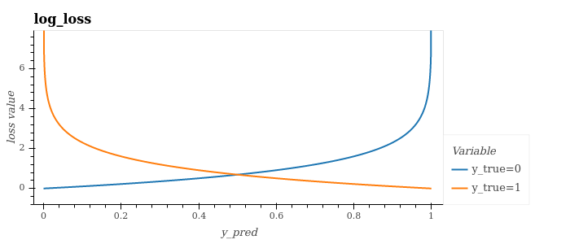

# Losses and Metrics

Loss functions are normally minimised (e.g. for learning/optimising a model), and metrics are normally maximised (e.g for further evaluating the performance of a model). All loss and metric functions have been designed to work in a similar way to [scikit-learn metrics](https://scikit-learn.org/stable/modules/classes.html#module-sklearn.metrics) if available, otherwise [tensorflow](https://www.tensorflow.org/api_docs/python/tf)/[tensorflow addons](https://www.tensorflow.org/addons/api_docs/python/tfa/) (e.g. same names, similar implementations), and have the form:

```python
function_name(y_true: jnp.ndarray, y_pred: jnp.ndarray) -> jnp.ndarray
```

and can be imported with `from jax_toolkit.losses import LOSS_FUNCTION` or `from jax_toolkit.metrics import METRIC_FUNCTION`. 

## Classification
#### Losses
| Name | Notes |
|---|---|
| [log_loss](https://github.com/asmith26/jax_toolkit/blob/master/jax_toolkit/losses.py#L9) (aka. binary/multi-class log loss or binary/categorical crossentropy) | This applies a large penalty for confident (i.e. with probability 1) wrong predictions (see images below). |
| [squared_hinge]() | This has been shown to converge faster, provide better performance and be more robust to noise (see [this paper](https://arxiv.org/abs/1702.05659)). Expects `y_true` to be binary classifications in the set {-1, +1}. |
| [kullback_leibler_divergence] | Measure how the probability distributions of y_true and y_pred differ. 0 := identical. |
https://github.com/tensorflow/tensorflow/blob/v2.2.0/tensorflow/python/keras/losses.py#L1598-L1636

| [sigmoid_focal_crossentropy] | Shown to be useful for classification when you have highly imbalanced classes (e.g. for object detection where the imbalance between the background class and other classes is extremely high). |
https://github.com/tensorflow/addons/blob/v0.10.0/tensorflow_addons/losses/focal_loss.py#L90

| [giou_loss] | Generalized Intersection over Union (GIoU) is designed to improve on intersection_over_union (see below). |
https://github.com/tensorflow/addons/blob/v0.10.0/tensorflow_addons/losses/giou_loss.py


https://towardsdatascience.com/handling-class-imbalanced-data-using-a-loss-specifically-made-for-it-6e58fd65ffab




#### Metrics
| Name | Notes |
|---|---|
| [balanced_accuracy] | Good interpretability, thus useful for displaying/explaining results.  |
https://scikit-learn.org/stable/modules/generated/sklearn.metrics.balanced_accuracy_score.html#sklearn.metrics.balanced_accuracy_score

| [intersection_over_union] (aka. Jaccard Index) | Useful for image segmentation problems, including for handling imbalanced classes (it gives all classes equal weight). |
https://github.com/keras-team/keras-contrib/blob/master/keras_contrib/losses/jaccard.py#L4
https://scikit-learn.org/stable/modules/generated/sklearn.metrics.jaccard_score.html#sklearn.metrics.jaccard_score

| [matthews_correlation_coefficient] | - Lots of symmetry (none of True/False Positives/Negatives are more important over another).<br/>- Good interpretability (1 := perfect prediction, 0 := random prediction, −1 := total disagreement between prediction & observation). |
https://scikit-learn.org/stable/modules/generated/sklearn.metrics.matthews_corrcoef.html#sklearn.metrics.matthews_corrcoef


## Regression
#### Losses
| Name | Notes |
|---|---|
| [mean_absolute_error](https://github.com/asmith26/jax_toolkit/blob/master/jax_toolkit/losses.py#L32) | Good interpretability, thus useful for displaying/explaining results. |
| [median_absolute_error](https://github.com/asmith26/jax_toolkit/blob/master/jax_toolkit/losses.py#L39) | - Good interpretability, thus useful for displaying/explaining results.<br/>- Median can be more robust that the mean (e.g the mean number of legs a dog has is less than 4, whilst the median is 4). |
| [max_absolute_error](https://github.com/asmith26/jax_toolkit/blob/master/jax_toolkit/losses.py#L46) | Good interpretability, thus useful for displaying/explaining results. |
| [mean_squared_error](https://github.com/asmith26/jax_toolkit/blob/master/jax_toolkit/losses.py#L53) | Relatively simple and (mathemtically) convenient. |
| [mean_squared_log_error] | For problems where y_true has a wide spread or large values, this does not punish a model as heavily as mean squared error. |
https://scikit-learn.org/stable/modules/generated/sklearn.metrics.mean_squared_log_error.html#sklearn.metrics.mean_squared_log_error

#### Metrics
| Name | Notes |
|---|---|
| [r2_score](https://github.com/asmith26/jax_toolkit/blob/more_losses_and_metrics/jax_toolkit/metrics.py#L6) | Indication of goodness of fit. 1.0 := perfect fit, 0 := constant model that always predicts the mean of y. |
